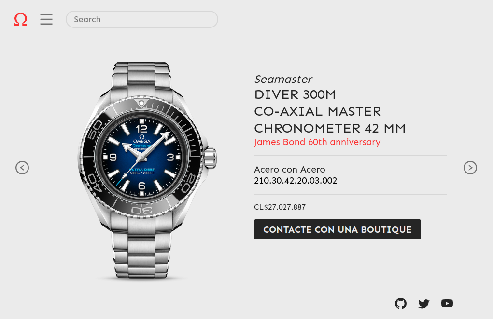

# Plantilla: Muestra en detalle de productos o personajes

Esta es la típica muestra de detalles de los productos de una tienda, o info de personajes de un videojuego. Muy sencilla pero útil,desarrolada en ReactJS, incluye botones de "anterior" y "siguiente" con transiciones de la librería [React Transition Group](https://reactcommunity.org/react-transition-group/) para hacer más agradable el cambio entre productos a ojos del usuario.

### ¿Qué es _**Omega Watches**_?

Según 🤓 [Wikipedia](<https://es.wikipedia.org/wiki/Omega_(relojer%C3%ADa)>): _**Omega**_ es un fabricante de relojes de lujo con base en Biel/Bienne, Suiza, perteneciente al Grupo Swatch.

Dada su veteranía, su popularidad, el haber sido el reloj empleado por astronautas en la Luna,​ su larga relación con el cronometraje deportivo y el ser patrocinador de los Juegos Olímpicos, Omega es uno de los emblemas de la industria relojera suiza.

Y obvio, el reloj del agente **007**, **James Bond** es un Omega, el cual va variando su modelo con el paso de las películas.

En la imagen: James Bond (Daniel Craig) usando un reloj Omega, modelo Planet Ocean 600M Skyfall, cuyo precio de lanzamiento fue de aproximadamente **155 millones** de pesos chilenos

_fin del friki moment_.

## Tecnologías usadas

> **Aclaraciones:** (FAQs)
>
> No ha sido probado para tener soporte crossbrowsing
>
> Ha sido programado con fines académicos

<!-- 

 -->

---

<!-- ## 📄 Licencia

MIT Public License v3.0
No puede usarse comercialmente -->
